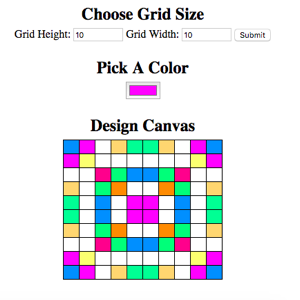

# Pixel artwork maker

Use this web app make pixel-style artwork. Set the height and width of the grid and click `Submit` to build a grid on the page. The grid cells form a canvas of white squares with black outlines. 

Then, choose a color and click a cell in the grid to fill it in with that hue. Use the palette to change the color as many times you want to create patterns and designs in the grid.

## Technology

- HTML 
- CSS 
- JavaScript
- jQuery

_Note: I built this app as the final project for my [Udacity Grow with Google developer scholarship](https://www.udacity.com/grow-with-google). The starter HTML and CSS were provided for the project, though the JavaScript and jQuery code is original._ 